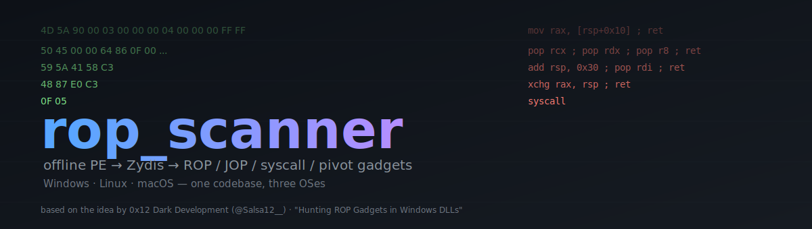
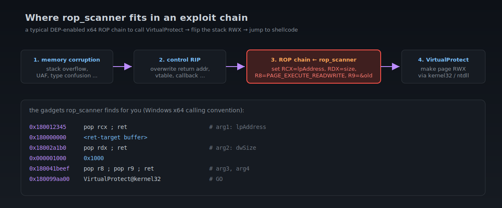
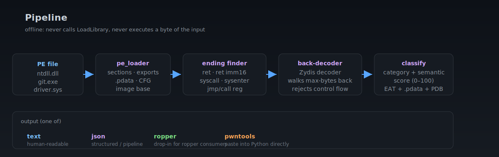
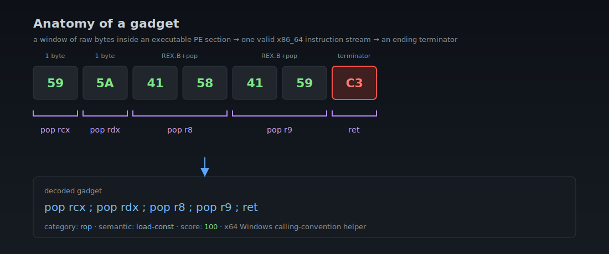
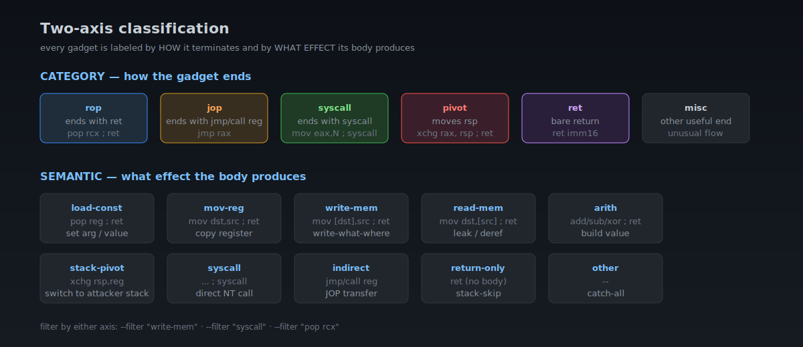
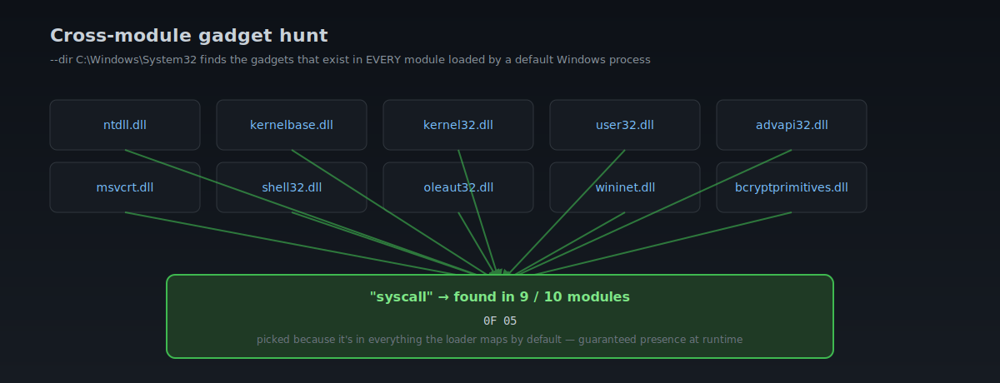
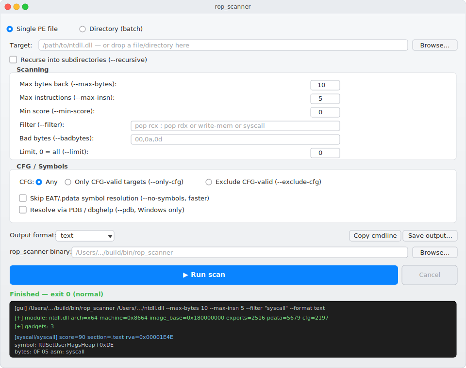

<p align="right">
  <a href="README.md">🇬🇧 English</a> ·
  <a href="README_ru.md">🇷🇺 Русский</a> ·
  <a href="README_ua.md">🇺🇦 Українська</a> ·
  <b>🇨🇳 中文</b> ·
  <a href="README_ge.md">🇩🇪 Deutsch</a> ·
  <a href="README_fr.md">🇫🇷 Français</a>
</p>

<p align="center">
  
</p>

# rop_scanner

**跨平台（Windows / Linux / macOS）离线扫描器,用于在 Windows PE 文件中查找 ROP、JOP、syscall 和 stack-pivot gadget。** 直接从磁盘解析 DLL / EXE / SYS / CPL / OCX / DRV / EFI 文件,绝不将它们加载到进程地址空间,使用 [Zydis](https://github.com/zyantific/zydis) 反汇编引擎解码每个字节,并以四种格式之一输出按分数排名的 gadget:`text`、`json`、`ropper` 或可直接粘贴的 `pwntools` Python 字典。

> 思路与原始文章 — **0x12 Dark Development** ([@Salsa12__](https://twitter.com/Salsa12__)),
> [《Hunting ROP Gadgets in Windows DLLs》](https://medium.com/@s12deff/hunting-rop-gadgets-in-windows-dlls-3184e4eeba62)。
> 本项目是上述思路的独立 C++17 实现与扩展。

---

## 目录

1. [为什么需要这个](#1-为什么需要这个)
2. [内部结构与工作原理](#2-内部结构与工作原理)
3. [Gadget 的解剖](#3-gadget-的解剖)
4. [分类:类别 × 语义](#4-分类类别--语义)
5. [构建](#5-构建)
6. [快速开始](#6-快速开始)
7. [完整 CLI 参考](#7-完整-cli-参考)
8. [运行场景](#8-运行场景)
9. [Qt6 GUI](#9-qt6-gui)
10. [漏洞利用开发中的应用](#10-漏洞利用开发中的应用)
11. [与替代方案的比较](#11-与替代方案的比较)
12. [其他适用场景](#12-其他适用场景)
13. [限制](#13-限制)
14. [致谢与法律说明](#14-致谢与法律说明)

---

## 1. 为什么需要这个

现代 x86_64 Windows 用户态漏洞利用都会撞上同一堵墙:获得 RIP 控制权后,仍需在不触发 DEP / CFG / CET 的前提下实现**代码执行**。经典答案是 **Return-Oriented Programming**:用已加载代码的短小片段(`pop rcx ; ret`、`xchg rax, rsp ; ret`、`syscall` 等)拼出一个「程序」,通过栈返回顺序激活后,它们自己完成所需工作 — 通常会走到 `VirtualProtect` 或直接 `syscall NtProtectVirtualMemory`,将 shellcode 页面标记为 RWX。

<p align="center">
  
</p>

只有当你拥有一份**合适的 gadget 目录**(目标进程中确保已映射的模块内的精确 RVA),这套办法才能奏效。而难点正在这里:

- **MSVC 不会原生生成「方便」的 gadget。** `pop rcx ; pop rdx ; pop r8 ; pop r9 ; ret`(Windows x64 调用约定)几乎从未作为函数尾声自然出现。必须**作为指令偏移的副产物**才能挖到 — 即,让解码器从非自然对齐的字节边界启动。
- **CFG、XFG、CET Shadow Stack** 砍掉一部分候选。你需要知道哪些 RVA 是合法的间接调用目标(`IMAGE_LOAD_CONFIG_DIRECTORY.GuardCFFunctionTable`),才能或瞄准它们,或反过来回避。
- **Bad bytes**(`\x00`、`\x0a`、`\x0d`、协议终结符、校验标记)能把任何「通用」扫描器的结果直接砍掉一半。
- **跨模块搜索。** 真正有价值的 gadget 是那些**在每个默认加载的模块中都存在**的。任何绑定到特定 DLL 的 `pop rcx ; ret`,只要受害者跑的是不同 Windows 版本或加载不同模块,就立刻失效。

`rop_scanner` 正面解决了这四个问题:完整的 Zydis 级解码、CFG / `.pdata` / EAT 解析、搜索时直接过滤 bad bytes、批量模式中按 `(asm)` 跨数十个模块聚合。一个 `.cpp` 或整个 `C:\Windows\System32`,同一条命令搞定。

---

## 2. 内部结构与工作原理

<p align="center">
  
</p>

五个阶段,每个都在自己的 `.cpp` 中:

| 阶段 | 文件 | 作用 |
|---|---|---|
| PE 解析 | [pe_loader.cpp](src/pe_loader.cpp) + [pe_types.h](src/pe_types.h) | MZ → PE\\0\\0 → sections → `IMAGE_DIRECTORY_ENTRY_EXPORT`、`_EXCEPTION`(.pdata RUNTIME_FUNCTION)、`_LOAD_CONFIG`(CFG GuardCF 表) |
| 终结符发现 | [scanner.cpp](src/scanner.cpp) | 遍历每个 section 的每个字节,让 Zydis 在该偏移处尝试解码一条指令。如果结果是可接受的终结符(`ret`、`ret imm16`、`syscall`、`sysenter`、`jmp reg`、`call reg`)就记录下来 |
| 回退解码 | [scanner.cpp](src/scanner.cpp) | 对每个终结符,尝试从 `endPos - maxBytes` 到 `endPos` 的所有起始偏移。用 Zydis 向前解码。链条有效当且仅当它在 `--max-insn` 条指令内**恰好**终止于该终结符,且主体内没有任何控制流指令 |
| 分类 | [gadget.cpp](src/gadget.cpp) | 类别(由终结符决定)+ 语义(由主体效果决定)+ 分数(0–100),针对 x64 Windows ABI 给予加成 |
| 注释 | [symbol_resolver.cpp](src/symbol_resolver.cpp) | 来自 EAT 的最近导出符号、来自 `.pdata` 的包含函数、可选的 PDB(通过 `dbghelp`,仅限 Windows)、CFG 有效/无效目标标记 |

核心原则:

- **完整的解码器。** 初版自带一个手写的约 250 行 mini-decoder,只认识 `pop reg`、`ret`、几种 `mov` 和 `add rsp`。Zydis 4.1 覆盖整个 x86 / x86_64,包括 VEX / EVEX、带内存操作数的 `mov [mem], reg`、`lea`、`cmov*`、`pushfq` / `popfq`,以及任何内存操作数。这给了真正的 `write-mem` / `read-mem` 搜索 — 这是初版做不到、也是许多「小型」扫描器永远做不到的事 — 同时分类逻辑仍可通过遍历 Zydis 的结构化操作数保持轻量。
- **无副作用。** 二进制解析器从不调用 `LoadLibrary`,从不把字节交给 JIT 或任何有副作用的东西。可以安全扫描已知的恶意样本。
- **单一交付物。** 自包含的可执行文件,除 libc / libstdc++ 之外没有运行时依赖。在 Windows 上额外多一个**可选**的 `dbghelp.dll` 依赖(任何 Windows 安装都自带)。

---

## 3. Gadget 的解剖

<p align="center">
  
</p>

一张图说明:原始 7 个字节 `59 5A 41 58 41 59 C3` 被 Zydis 解码为 5 条指令 — `pop rcx`、`pop rdx`、`pop r8`(REX.B + pop)、`pop r9`(REX.B + pop)、`ret`。终结符是 `C3`(`ret`)。主体是四条无条件 `pop`,做的正是 Windows x64 调用约定要求的事:把 `rcx/rdx/r8/r9`(WinAPI 前四个参数)从栈上取出来。

`rop_scanner` 能在任何足够大的 PE 文件中以非自然对齐的字节边界找到这种 gadget。`pop rXX`(x64 ABI)每出现一次 +10 分,`xchg rax, rsp` / `leave` +15 分,这条链得到的最终分数是 **100/100**。

---

## 4. 分类:类别 × 语义

<p align="center">
  
</p>

每个 gadget 都按**两个独立维度**打标签,两个标签都能作为 `--filter` 的子串过滤:

- **Category** 告诉你 gadget**怎么**结束。这一维度决定它在链中的位置:`rop` 通过栈接入,`jop` 通过寄存器间接 jmp/call 接入,`syscall` 是退出到内核,`pivot` 是切换 RSP。
- **Semantic** 告诉你 gadget 在起点到终结符之间**做什么**:加载常量、复制寄存器、写/读内存、做算术、切换栈。

实用性:`--filter "write-mem"` 会找出**所有** write-what-where 原语(`mov [rax], rdx ; ret`、`mov [rcx+0x10], r8 ; ret`、…),无论它们怎么结束。`--filter "load-const"` 找出所有「参数加载器」。

---

## 5. 构建

> 所有构建都需要 **C++17** 编译器和 **CMake ≥ 3.16**。Zydis 会在首次 configure 时通过 `FetchContent` 自动拉取。

### Windows  (MSVC / Visual Studio 2019+)

在 *Developer Command Prompt for VS 2022* 中(或在普通 cmd 中先 `call vcvars64.bat`):

```cmd
cmake -S . -B build -G Ninja -DCMAKE_BUILD_TYPE=Release
cmake --build build
:: -> build\bin\rop_scanner.exe
```

链接时会自动连上 `dbghelp.lib`,以便 `--pdb` 进行可选的 PDB 解析。如果没有 Ninja,去掉 `-G Ninja`,MSBuild 自己能搞定。

构建末尾的预期输出:

```
[42/43] Building CXX object CMakeFiles/rop_scanner.dir/src/scanner.cpp.obj
[43/43] Linking CXX executable bin/rop_scanner.exe
```

### Linux  (GCC / Clang)

在 Ubuntu 22.04 + GCC 11.4 上测试过。除了 `cmake`、C++ 编译器和 `make`/`ninja`,没有其他系统依赖:

```sh
sudo apt install -y cmake g++ make            # Debian/Ubuntu
# 或
sudo dnf install -y cmake gcc-c++ make        # Fedora/RHEL

cmake -S . -B build -DCMAKE_BUILD_TYPE=Release
cmake --build build -j$(nproc)
# -> build/bin/rop_scanner
```

GCC < 9 把 `<filesystem>` 分到了 `libstdc++fs` 中 — CMake 会自动帮你链上。Clang 10+ 和 GCC 9+ 则不需要任何额外操作。

### macOS  (Apple Clang)

只需要 Xcode Command Line Tools(`xcode-select --install`)和任意 CMake(Homebrew 或官方):

```sh
brew install cmake          # 一次性
cmake -S . -B build -DCMAKE_BUILD_TYPE=Release
cmake --build build -j
# -> build/bin/rop_scanner
```

Apple Silicon(arm64)和 Intel(x86_64)都能用 — `rop_scanner` 只是**读取** PE 字节而不执行,所以宿主架构无关紧要。

> Linux / macOS 上 `--pdb` 会被接受但静默无效(没有 `dbghelp`)。EAT + `.pdata` 解析仍然工作,对于公共 Windows DLL 来说,几乎能给你公开 PDB(stripped)能给的全部信息。

### 跨平台字节级一致性

完全相同的 x64 `ntdll.dll` 在三个平台上产生**完全相同**的输出:

| 平台 | 编译器 | `exports` | `.pdata` | `cfg` | `pop rsi ; pop rdi ; ret` 首个命中 |
|---|---|---|---|---|---|
| Windows 11 x64 | MSVC 19.43 | 2516 | 5679 | 2197 | `0x000026B9` — `RtlGetUserInfoHeap+0xB9` |
| macOS arm64 | AppleClang 21 | 2516 | 5679 | 2197 | `0x000026B9` — `RtlGetUserInfoHeap+0xB9` |
| Linux x64  | GCC 11.4   | 2516 | 5679 | 2197 | `0x000026B9` — `RtlGetUserInfoHeap+0xB9` |

[pe_types.h](src/pe_types.h) 中对每个 PE 结构体大小的 `static_assert` 保证了这一点。

---

## 6. 快速开始

第一分钟:

```sh
# 1. 对 ntdll.dll 做一次基本扫描
./build/bin/rop_scanner /path/to/ntdll.dll | head -40
```

预期的第一页输出(对 Windows 11 的 x64 ntdll.dll):

```text
[+] module: ntdll.dll arch=x64 machine=0x8664 image_base=0x180000000
    sections=15 exports=2516 pdata=5679 cfg=2197
[+] gadgets: 17243

[pivot/stack-pivot] score=100 section=.text rva=0x0011F03A
  symbol: RtlCaptureContext2+0xFA
  function: fn_0x11EF40+0xFA
  bytes: 48 83 C4 30 59 C3
  asm  : add rsp, 0x30 ; pop rcx ; ret

[rop/load-const] score=70 section=.text rva=0x000026B9
  symbol: RtlGetUserInfoHeap+0xB9
  function: fn_0x2600+0xB9
  bytes: 5E 5F C3
  asm  : pop rsi ; pop rdi ; ret
...
```

第一行是模块的元信息;后面是按分数降序排列的 gadget。每个 gadget 显示:`[category/semantic]`、分数、section、RVA 和文件偏移、EAT 符号(`RtlGetUserInfoHeap+0xB9`)、来自 `.pdata` 的包含函数、原始字节、反汇编。

---

## 7. 完整 CLI 参考

```text
Usage:
  rop_scanner <pe-file> [pe-file ...] [options]
  rop_scanner --dir <path> [--recursive] [options]
```

### 扫描

| 选项 | 默认 | 含义 |
|---|---|---|
| `--max-bytes N` | 10 | 从终结符向前尝试多少字节作为起点。越小越快,越大越能在非自然对齐边界上捕获到「间隙 gadget」。 |
| `--max-insn N` | 5 | gadget 内的最大指令数(含终结符)。实际有用的链很少超过 6。 |
| `--min-score N` | 0 | 低于阈值的全部丢弃。实际工作中我用 60-70。 |
| `--filter TEXT` | — | 在 `asm + section + category + semantic + symbol + function` 中做大小写不敏感的子串搜索。最强大的标志之一:可按反汇编搜索(`"pop rcx ; pop rdx"`)、按语义(`"write-mem"`)、按符号(`"Rtl"`)、按类别(`"pivot"`)。 |
| `--badbytes B,…` | — | 逗号分隔的「坏字节」列表:`00,0a,0d,20`。原始字节中**含任意一个**的 gadget 会被丢弃。这正是你处理字符串相关漏洞(`strcpy`、`sprintf`、`gets` 等)需要的过滤器。 |
| `--limit N` | 0(全部) | 排序后只保留前 N 个。 |

### CFG(Control Flow Guard)

| 选项 | 含义 |
|---|---|
| `--only-cfg` | 仅保留 `IMAGE_LOAD_CONFIG_DIRECTORY.GuardCFFunctionTable` 中列出的 RVA。如果你的 RIP 劫持要经过带 CFG 检查的间接调用,只有这些 gadget 真正可用。 |
| `--exclude-cfg` | 反过来 — 丢弃 CFG 有效目标。当你通过 `ret` 串联 gadget(CFG 不检查 ret 目标)但又想最小化冲突时有用。 |

### 符号

| 选项 | 含义 |
|---|---|
| `--no-symbols` | 跳过 EAT / `.pdata` 注释。批量扫描时明显更快。 |
| `--pdb` | 通过 `dbghelp.dll` 做 PDB 解析。尊重 `_NT_SYMBOL_PATH`。在 Linux / macOS 上被接受但无效。 |

### 批量模式

| 选项 | 含义 |
|---|---|
| `--dir PATH` | 扫描该目录下所有 PE。识别的扩展名:`dll exe sys cpl ocx drv efi`。 |
| `--recursive` | 递归进入子目录。 |

批量模式下,gadget 会按 `(asm)` 跨**不同模块**去重,并按 `module_count desc, score desc` 排名。列表顶端就是最「无处不在」的 gadget。

### 输出格式

| `--format …` | 输出 |
|---|---|
| `text`(默认) | 人类可读 |
| `json` | 全部信息结构化输出。批量模式下还包含所属模块列表。 |
| `ropper` | `0x180012345: pop rcx; ret;` — 可直接喂给 `ropper` / `ROPgadget` 消费者 |
| `pwntools` | 带 image_base、RVA、asm 和 symbol 的有效 Python 字典 — `cat output.py >> exploit.py` |

### 其他

| 选项 | 含义 |
|---|---|
| `--help`、`-h`、`/?` | 显示帮助 |

---

## 8. 运行场景

### 场景 1.  Win x64 调用约定辅助器

目标 — 找出经典的 WinAPI 前四个参数寄存器加载器:

```sh
rop_scanner ntdll.dll \
  --filter "pop rcx ; pop rdx ; pop r8" \
  --max-insn 6 \
  --limit 10
```

如果 gadget 没有以「干净」形式出现(在 ntdll 中确实少见),扫描器会自己找到非自然对齐的等价物:

```text
[rop/load-const] score=92 section=.text rva=0x001255F4
  symbol: tan+0x3F4
  bytes: 5C C1 F2 0F 59 C2 F2 0F
  asm  : pop rsp ; shl edx, 0x0F ; pop rcx ; ret 0xFF2
```

这是 `tan()`(libm 的数学函数)函数体中,从非自然指令边界开始的字节。

### 场景 2.  对未对齐栈做 stack pivot

当 RIP 在栈对齐不可预测的位置被劫持时,你需要一个 **pivot** — 通常是 `xchg rax, rsp ; ret` 或 `add rsp, 0x__ ; ret`:

```sh
rop_scanner ntdll.dll --filter "pivot" --min-score 95 --limit 5
```

得到精确 RVA 和 `.pdata` 函数名的现成候选。

### 场景 3.  Write-what-where

搜索是**语义级**而非指令文本级:

```sh
rop_scanner ntdll.dll --filter "write-mem" --badbytes 00 --min-score 70
```

输出 — 所有 `mov [reg+disp], reg ; ret` 等价物,且字节中没有零。

### 场景 4.  Bad-byte-aware(strcpy 全链)

```sh
rop_scanner ntdll.dll \
  --filter "pop rcx ; ret" \
  --badbytes 00,0a,0d,20,3b \
  --format pwntools > rop_chunk.py
```

`--badbytes` 去掉所有含零字节(会截断字符串)、`\n`/`\r`(若漏洞在 HTTP 头中)、空格和 `;` 的 gadget。`--format pwntools` 直接给你一个能导入的字典。

### 场景 5.  跨模块查找「保证已加载」的 gadget

<p align="center">
  
</p>

```sh
rop_scanner --dir C:\Windows\System32 \
  --filter "syscall" \
  --min-score 80 \
  --no-symbols \
  --limit 50
```

会找出所有 2 字节的 `0F 05`,以及更复杂的、以 `syscall` 结尾的结构。按 gadget 在多少模块中存在排序。列表顶端的 gadget 是链条最可靠的基础:它们能抵御 Windows 重构和版本切换。

### 场景 6.  CFG-aware 间接调用劫持

```sh
rop_scanner ntdll.dll --only-cfg --filter "jmp r" --limit 20
```

会找出 CFG 允许跳到的 `jmp reg` gadget — 即在 CET-defended Windows 10/11 上做间接调用劫持时的合法落点。

### 场景 7.  符号注释 + JSON 给流水线

```sh
set _NT_SYMBOL_PATH=srv*C:\symbols*https://msdl.microsoft.com/download/symbols
rop_scanner ntdll.dll \
  --pdb \
  --min-score 70 \
  --format json > ntdll_gadgets.json
```

得到带 PDB 符号的结构化目录,后续可加载到 IDE / IDA 脚本 / 你自己的 gadget 调度器中。

### 场景 8.  扫描驱动

```sh
rop_scanner C:\Windows\System32\drivers\hidusb.sys --filter "syscall" --limit 5
```

驱动和普通 PE32+ 解析方式完全一样 — 无需任何修改即可用于内核态 gadget 狩猎。

---

## 9. Qt6 GUI

如果你不想记标志,有一个跨平台的 Qt6 GUI(可回退到 Qt5),它从同一棵源码树构建,只是用合适的参数调用 CLI。

<p align="center">
  
</p>

**功能:**

- 通过 `Browse…` 或**拖放**直接到窗口里选择文件或目录。
- 所有 CLI 标志以表单字段呈现(`--max-bytes`、`--max-insn`、`--min-score`、`--filter`、`--badbytes`、`--limit`、`--only-cfg`/`--exclude-cfg`、`--no-symbols`、`--pdb`、`--recursive`)。
- 自动检测 `rop_scanner` 二进制路径(在 GUI 旁、`../bin`、`../../build/bin`、macOS bundle 的 `Resources/`)。
- 结果以流式方式写入内置的暗色终端。
- **Copy cmdline** — 拼出在终端中重现本次运行的完整 shell 命令。便于写漏洞利用文档或交给同事。
- **Save output…** — 保存为 `.txt`、`.json` 或 `.py`(按 `--format` 决定)。
- 所有字段在两次启动之间通过 `QSettings` 持久化。
- 通过 `Cancel` 可干净地终止卡死的扫描(发送 `SIGKILL`)。

**代码位置:** [gui/](gui/) — 独立的 CMake 目标。三个文件:[`MainWindow.cpp`](gui/src/MainWindow.cpp)(表单 + 槽函数)、[`ScannerRunner.cpp`](gui/src/ScannerRunner.cpp)(`QProcess` 的薄封装)、[`main.cpp`](gui/src/main.cpp)(入口)。链接到首先找到的 `Qt6::Widgets` 或 `Qt5::Widgets`。

### 构建 GUI

GUI 是主构建的**可选**附加组件。用同样的构建脚本,加一个标志即可。

#### macOS

```sh
brew install qt           # 一次性
GUI=1 ./mac_build.sh
open build/bin/rop_scanner_gui.app
```

#### Linux  (Debian / Ubuntu)

```sh
sudo apt install qt6-base-dev libvulkan-dev
GUI=1 ./linux_build.sh
./build/bin/rop_scanner_gui
```

(在 Fedora/RHEL 上用 `qt6-qtbase-devel vulkan-headers` 代替)。

#### Windows

按以下方式之一安装 Qt6:

1. 官方安装器:<https://qt.io/download-open-source>
2. `vcpkg install qt6-base`
3. MSYS2:`pacman -S mingw-w64-x86_64-qt6-base`

然后通过环境变量指定前缀并运行:

```cmd
set QT_PREFIX=C:\Qt\6.6.0\msvc2019_64
windows_build.bat build gui
build\bin\rop_scanner_gui.exe
```

### 你将看到的窗口

顶部 — 模式选择(单文件 / 目录批量)、目标路径、递归复选框。下方是 **Scanning** 区,里面是数字字段和搜索过滤器;**CFG / Symbols** 区,里面是 CFG 过滤的单选组和 `--no-symbols` / `--pdb` 复选框。再下面 — 输出格式下拉、`Copy cmdline` / `Save output…` 按钮、自带自动检测的 `rop_scanner` 二进制路径输入框,以及大号的 `▶ Run scan` 按钮。最底部 — 状态行和一个暗色控制台,实时流式显示 stdout(白色)和 stderr(琥珀色)。

---

## 10. 漏洞利用开发中的应用

典型工作流:

1. **确定目标环境** — 哪个 Windows 版本、哪些模块保证已加载、有什么缓解措施(CFG / XFG / CET / Shadow Stack)。
2. **抓取这些模块的镜像**(从干净安装中取,或从 VM 中提取)。
3. **以批量模式运行 `rop_scanner`**,带 `--no-symbols` 加速、`--format json` 进流水线。会得到约数万条 gadget 的目录。
4. **缩小范围**到具体任务:
   - 写原语 → `--filter "write-mem"`
   - 控制 `rcx/rdx/r8/r9` → `--filter "load-const"` + 按 RVA 验证
   - pivot → `--filter "pivot" --min-score 95`
   - 系统调用 → `--filter "syscall"`
5. **加上 `--badbytes`**,匹配该漏洞输入字符串的格式。
6. **如果漏洞利用走间接调用** — 加上 `--only-cfg`。
7. **拼链条。** `--format pwntools` 在这一步能省半小时。

无论是用户态(浏览器、解析器、RDP 客户端)还是内核态(覆盖表、驱动上下文里的 ROP),流程都一样。

### 不只是 Windows 目标

PE 文件就是文件;解码器 Zydis 就是 x86 / x86_64 解码器。所以 `rop_scanner` 完全可以扫描:

- **Linux 上用 MinGW 构建的 PE** — 用于交叉编译漏洞利用和测试。
- **Windows 恶意软件** — 在 Linux / macOS 逆向工程机上扫,绝不会有加载风险。
- **UEFI 固件**(`.efi` 扩展名)— 也是 PE。
- **没有 PDB 的旧驱动**。

---

## 11. 与替代方案的比较

| 工具 | x86/x64 | PE | ELF | Mach-O | 语义 | 跨模块 | CFG-aware | PDB | 跨平台二进制 |
|---|---|---|---|---|---|---|---|---|---|
| **rop_scanner** | ✅ | ✅ | — | — | ✅ | ✅ | ✅ | ✅(Win) | **✅ Win / Linux / mac** |
| ROPgadget (Python) | ✅ | ✅ | ✅ | ✅ | — | — | — | — | ✅ |
| ropper (Python) | ✅ | ✅ | ✅ | ✅ | — | — | — | — | ✅ |
| rp++ | ✅ | ✅ | ✅ | ✅ | — | — | — | — | ✅ |
| angrop | ✅ | ✅ | ✅ | ✅ | ✅ | — | — | — | ✅(慢) |

`rop_scanner` 的优势恰好在*Windows 特定*的场景里:语义、CFG、`.pdata`、跨 `System32` 的批量搜索。同时它能在最适合写漏洞利用的地方 — 你自己的工作站上 — 构建和运行。

---

## 12. 其他适用场景

- **恶意软件分析。** 从可疑 DLL / EXE 中提取所有潜在 ROP 链,不必运行它。比较解包前后的 gadget 表 — 主体字节变了 → 解包器跑过了。
- **威胁猎杀 / 检测工程。** 给你的干净 Windows 机做快照(批量扫描 `System32`),然后定期重复。两次运行之间的差异 = 库被修改 = 该看看是谁动的。(微软按可预测的节奏给 ntdll 打补丁,gadget 目录也随之有可预测的变化;任何与 Win Update 对不上的差异都是可疑的。)
- **逆向工程。** gadget 目录就是函数「热点」的地图:哪里有短小尾声、哪里有 `syscall`、哪里有 pivot。让阅读反汇编更轻松。
- **CTF。** PE 类 pwn 挑战是标配。`--format pwntools` 省好几个小时。
- **教学。** 这是对 ROP 工作机制极佳的可视化:学生能看见原始字节、Zydis 解码出来的助记符、分类、分数。每一阶段的代码不过两屏。
- **编译器加固审计。** 想知道自己用 `cl.exe /GS /guard:cf` 编译出来的版本到底让攻击者少了多少 gadget?比较开关切换前后 `--only-cfg` 模式下的 `pivot` gadget 计数。

---

## 13. 限制

- **仅支持 x86 和 x86_64。** ARM64 / IA64 / RISC-V 的 PE 文件会被显式拒绝 — Zydis 不认识它们。
- **`.pdata` 解析只在 x64**(`RUNTIME_FUNCTION`)。x86 下 SEH 在别处存放,我们不用。
- **CFG 解析。** 读到标准 `IMAGE_LOAD_CONFIG_DIRECTORY` 的 `GuardFlags` 字段为止。如果微软将来改了结构布局,得跟着补。
- **不感知 CET / XFG** 的语义(不考虑 XFG type-hash)。计划进 v0.7。
- **单线程。** 批量扫描 `C:\Windows\System32`(~1500 个 PE)要几分钟。并行化大概十行 `std::async`,在 backlog 里。
- **PDB 只在 Windows**(通过 `dbghelp`)。Linux / macOS 上可以接 `llvm-pdbutil`,但还没做 — EAT 对公共模块通常足够。

---

## 14. 致谢与法律说明

- 原始思路和方法:**0x12 Dark Development** ([@Salsa12__](https://twitter.com/Salsa12__))
  — Medium 上的文章 [《Hunting ROP Gadgets in Windows DLLs》](https://medium.com/@s12deff/hunting-rop-gadgets-in-windows-dlls-3184e4eeba62)。
- 解码器:**[Zydis](https://github.com/zyantific/zydis)** by Florian Bernd 和团队 — 首次 CMake 配置时通过 `FetchContent` 拉取。
- 本项目是基于上述文章思路的独立 C++17 实现;代码从零写起。

**用途:** 用于分析你拥有或获明确授权研究的二进制文件 — 自有软件、训练场地、CTF、授权渗透测试、防御性研究、教学目的。原始思路作者和本实现作者均不为滥用行为承担责任。
